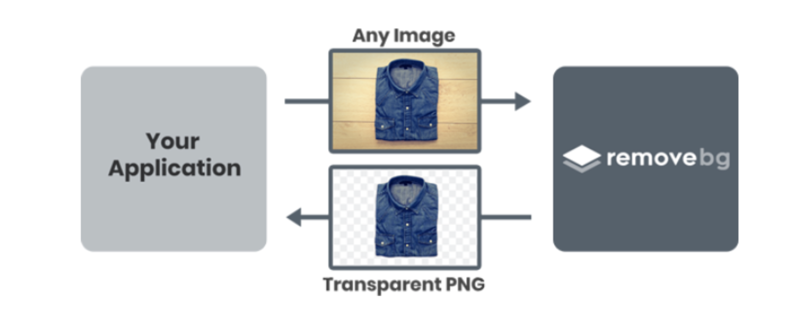
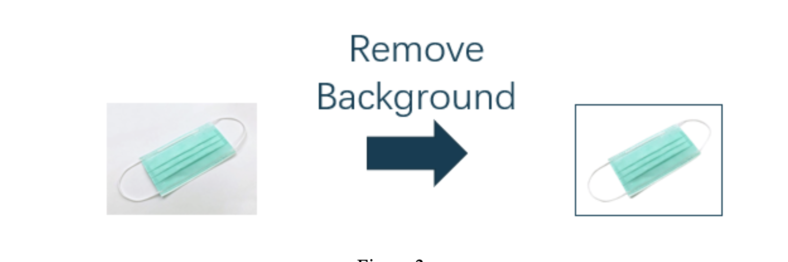
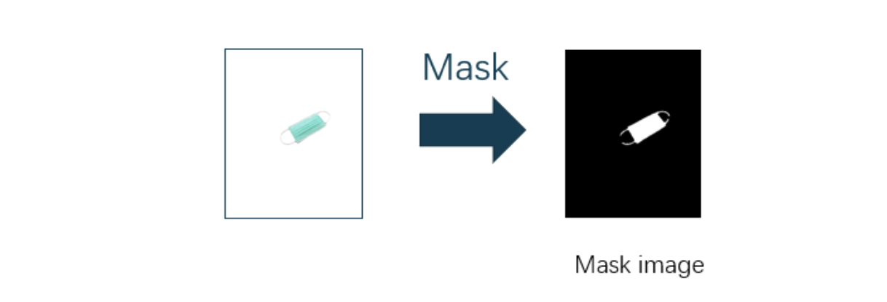
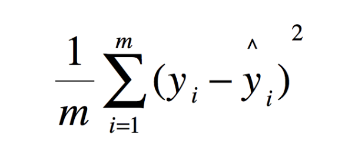
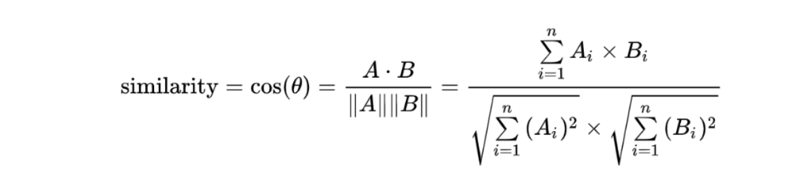
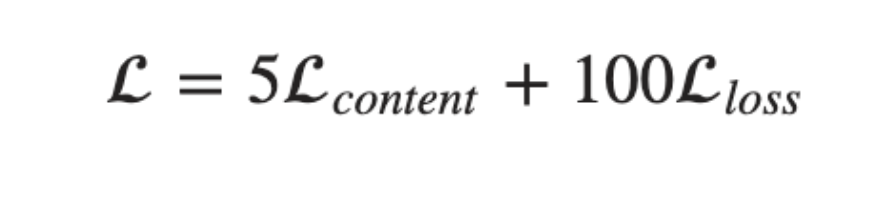
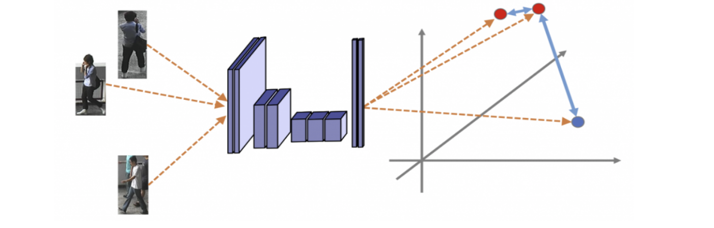
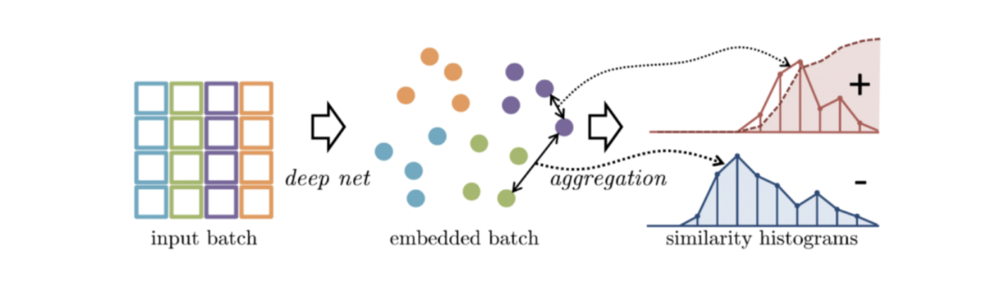
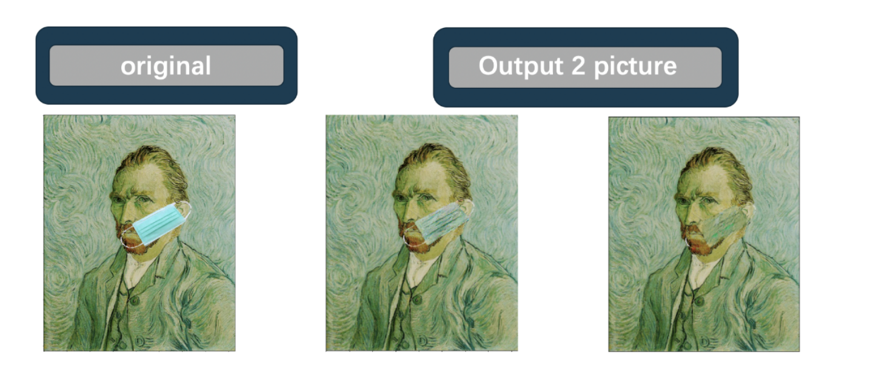

# Deep_painterly_harmonization

## Purpose

Why do we want to make this project ? Because we often see a lot of interesting meme, suddenly thought of making related themes. And recently, we have studied in deep learning related courses, so I would like to implement the Neural network through the project. We think this technology can be used as a way for corporate marketing, media and social media. Finally, we hope to compare the difference between the paper and our implementation.

##  Related Work

### Programming language: 
1. Python
### Environment :
1. Google Colab
### Package:
1. Open CV
2. Numpy
3. Pytorch
4. Pillow
5. Matplotlib
### API:
1. RemoveBg

### Remove background

We once used OpenCV to complete the background removal operation, but the effect was not very satisfactory. There are still many unremoved backgrounds on the edge of the
image. So,in order to complete the image processing, we decided to use the API, just use the program to join the registered account the key of the obtained free API will be input to the picture material to be processed. The back end of remove.bg will have a smart AI that will automatically separate the main body of the photo from the background. You can even input 1000 pictures at a time to remove the background. However, since it is a free service, there will be a limit on the number of times. Only 50 API calls per month can be provided, but it is quite enough for our interim report, and the processed pictures are used for subsequent masking of the pictures. For processing and synthesis, we can get the result of the style conversion we hope through this operation.

    

### Mask 

Using mask is to use selected images, graphics or objects to occlude the processed images (total or regional) to control the image processing area or process. In digital image processing, mask is a two-dimensional matrix array, and sometimes multi-valued images are also used. The main purpose is:

1. Extract the area of interest: multiply the pre-made area of interest mask with the image to be processed to obtain the image of the area of interest. The value of the image in the area of interest remains unchanged, while the value of the image outside the area is all 0.
2. Masking function: Use a mask to mask certain areas on the image so that it does not participate in the processing or calculation of the processing parameters, or only the masked area is processed or counted.
3. Structural feature extraction: Use similarity variables or image matching methods to detect and extract structural features similar to Mask in the image.
4. The production of special-shaped images. 
Processing steps:
Step 1: Create a mask image of the same size as the original image, and initialize all pixels to 0, so the entire image becomes an all-black image.

    

Step 2: Set all the pixel values of the reserved area in the mask image to 255, that is, the entire reserved area becomes white.

### Deliation

The concept of image expansion is to expand the white area (or highlight) in the image. The calculated result image is larger than the white area of the original image. It can also be imagined to make the object fat , and the width of this circle is determined by the size of the convolution kernel. In fact, the convolution kernel slides and calculates along the shadow. If there is only one pixel value in the range of the convolution kernel mxn, then the new pixel value is 1, otherwise the new pixel value the pixel value of keeps the original pixel value, which means that all pixels scanned by the convolution kernel will be expanded or dilated (to 1), so the white area of the entire image will increase.
Uses of Dilation:
Purpose 1: Dilation image expansion is usually used in conjunction with image erosion. First, the erosion method is used to narrow the lines in the image and also remove the noise, and then the image is expanded back through Dilation.
Purpose 2: Used to connect two very close but separate objects.

    

### Deliation

The concept of image expansion is to expand the white area (or highlight) in the image. The calculated result image is larger than the white area of the original image. It can also be imagined to make the object fat , and the width of this circle is determined by the size of the convolution kernel. In fact, the convolution kernel slides and calculates along the shadow. If there is only one pixel value in the range of the convolution kernel mxn, then the new pixel value is 1, otherwise the new pixel value the pixel value of keeps the original pixel value, which means that all pixels scanned by the convolution kernel will be expanded or dilated (to 1), so the white area of the entire image will increase.

Uses of Dilation:
Purpose 1: Dilation image expansion is usually used in conjunction with image erosion. First, the erosion method is used to narrow the lines in the image and also remove the noise, and then the image is expanded back through Dilation.

Purpose 2: Used to connect two very close but separate objects

## Deep Painterly Harmonization Theory

###  Style transfer

**Style transfer** is the technique of recomposing one image in the style of another. Two inputs, a content image and a style image are analyzed by a convolutional neural network which is then used to create an output image whose “content” mirrors the content image and whose style resembles that of the style image

### Foreword

We propose to make two different phase . The first one will focus more on the general style, giving an intermediate result that where the object will still stand out a bit in the picture. The second phase will focus more on the details, and smoothening the edges that could have appeared during the first part
We'll call the content picture the painting with our object pasted on it and the style picture the original painting. The input is the content picture for phase 1, the result of this first stage for phase 2. In both cases, we'll compute the results of the convolutional layers for the content picture and the style picture at first, which will serve as our reference features. Then we compute the results of the same convolutional layers for our input, compare them and calculate a loss from that.
We'll compute the gradients of this loss and use them to get a better input, then reiterate the process

### The First Pass

In this pass, first step we define two Loss Function, one is a content loss, that measures the difference between our input and the content image, a style loss, that measures the difference between our input and the style image, sum them with certain weights to get our final loss, and will mask all the parts of the image that have nothing to do with it when we compute our loss.
We will use a slightly dilated mask, that encircles a bit more than just the object we're adding. It's the mean-squared error (MSE) between the masked features of our content image and the masked features of our input, use the result of the fourth convolutional layer only for this content loss. Using one of the first convolutional layers would force the final output to match the initial object :

    

About style loss, We'll use Gram matrices like we do for regular style transfer, for each layer of results we have from our model, we'll look at each 3 by 3 part of the content features, and find the 3 by 3 patch in the style features that looks the most like it, and match them. To measure how much two patches look alike, we'll use the cosine similarity between them.

    

Once that mapping is done , we will transform the style features so that the centers of each 3 by 3 patch in the content features is aligned with its match in the style features. Then we will apply the resized mask on the input features and the style features, compute the Gram matrices of both of them then take the mean-squared error to give us the style loss.
Final loss of this first stage is then:

    

### The histogram loss

Histogram matching is a technique that is often used to modify a certain photograph with the luminosity or shadows of another.

    

We compute the histogram of each channel of the style features as a reference. Then, at each pass of our training, we calculate the remapping of our output features so that their histogram matches the style reference. We then define the histogram loss as being the the mean-squared error between the output features and their remapped version. The challenge here is to compute that remapping.

    

##  Conclusion

So, we will output 2 pictures in phase1, phase 2 and compare with original picture :

    

